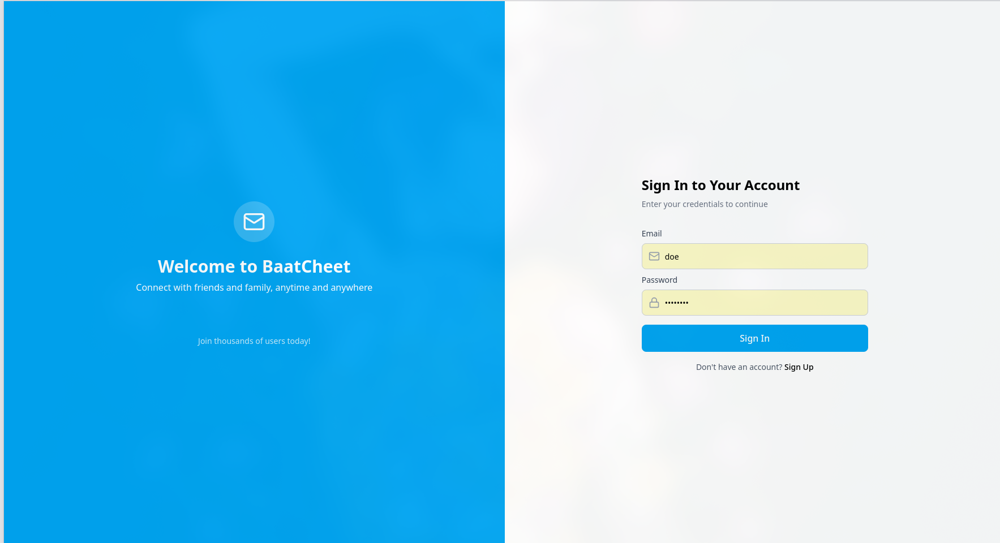

# 💬 BaatCheet - Frontend

The frontend client for **BaatCheet**, a modern, real-time chat application. Built with a focus on speed, responsiveness, and a seamless user experience.



## ✨ Features

- **⚡ Real-Time Messaging:** Instant message delivery using WebSockets (`socket.io-client`).
- **🟢 Live Status & Activity:** Real-time online/offline indicators and "typing..." animations.
- **🤝 Connect Codes:** Unique user IDs to securely search and add friends.
- **📎 Rich Media Sharing:**
  - **Images:** Secure image uploads with in-chat previews and download capabilities.
  - **Location:** Real-time location sharing rendered on interactive maps using Leaflet.
  - **Link Previews:** Automatic rich previews (Open Graph) for shared URLs.
- **🧠 Smart State Management:** Powered by **Zustand** for global UI state and **TanStack Query** (React Query) for efficient API data caching and infinite scrolling.
- **🔐 Robust Authentication UI:** Login and Registration forms with OTP verification, validated strictly using **React Hook Form** and **Zod**.
- **🎨 Modern UI/UX:** A clean, responsive, two-pane layout styled with **Tailwind CSS**, featuring crisp icons from **Lucide React** and smooth toast notifications via **Sonner**.

---

## 🛠️ Tech Stack

- **Core:** React 18, TypeScript, Vite
- **Styling:** Tailwind CSS
- **State Management:** Zustand, TanStack Query (React Query)
- **Real-Time:** Socket.io-client
- **Forms & Validation:** React Hook Form, Zod
- **Maps:** Leaflet, React-Leaflet
- **UI Assets:** Lucide React (Icons), Emoji-picker-react

---

## 📂 Key Directory Structure

```text
src/
├── components/
│   ├── ChatWindow/      # Message list, input area, media attachments
│   ├── Sidebar/         # Conversations list, search, add friend modal, profile
│   └── ui/              # Reusable components (Modals, LinkPreviews, LocationMaps)
├── contexts/            # SocketContext, ConversationsContext
├── hooks/               # Custom hooks (useMessages, useTypingListen, useFileUpload)
├── services/            # API client calls (authService, messageService)
├── stores/              # Zustand stores (authStore, conversationStore)
└── utils/               # Axios interceptors and helper functions
```

## 🚀 Getting Started

### 1. Prerequisites

Ensure you have Node.js installed (v18+ recommended). Note: You will need the BaatCheet Backend running locally or deployed for the app to function.

### 2. Installation

Clone the repository and install dependencies:

```bash
npm install
```

### 3. Environment Variables

Create a .env file in the root of the frontend directory and add your backend URLs (adjust the ports if your backend uses different ones):

```env
VITE_API_URL=http://localhost:4000/api
```

### 4. Run the Development Server

Start the Vite development server:

```bash
npm run dev
```

The application will be available at <http://localhost:5173>.

## 📝 Scripts

```bash
- `npm run dev` - Starts the development server.
- `npm run build` - Builds the app for production.
```
